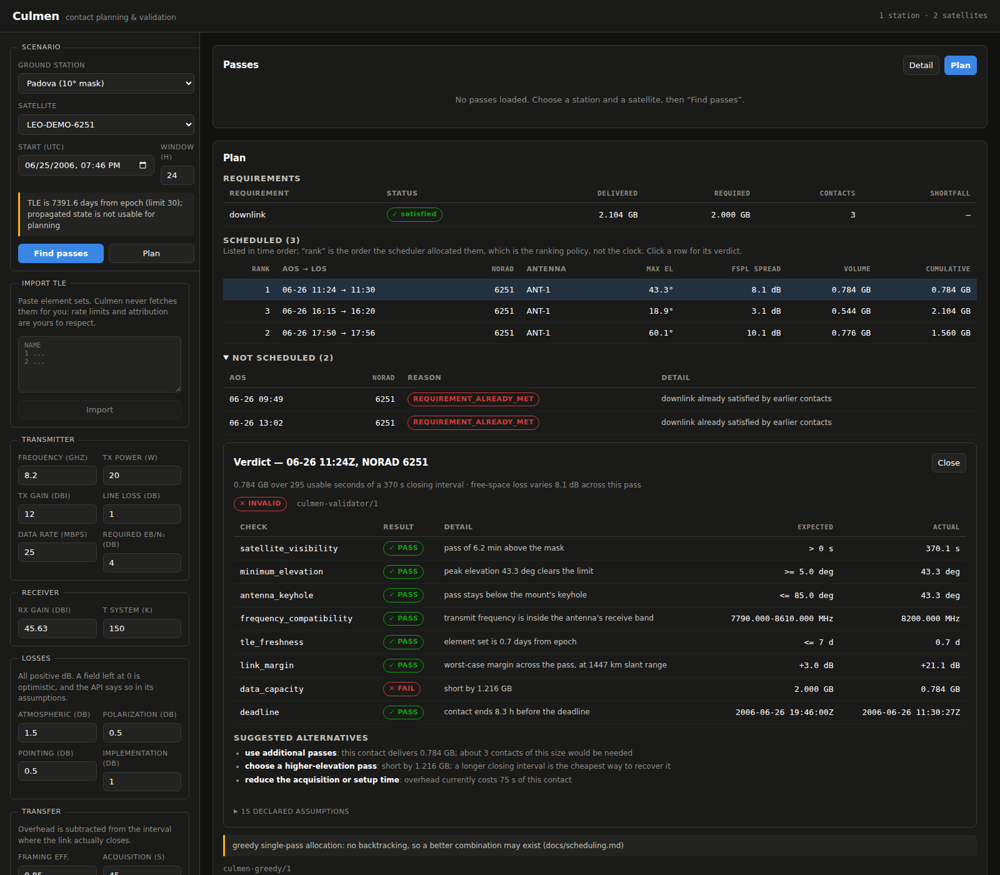

# Culmen

**Satellite / ground-station contact planning and validation.**

> Given a satellite, a ground station and a communication requirement — when
> can we make contact, will the link actually close, how much data can we move,
> and **which check fails if it doesn't?**

That last clause is the point. Pass prediction is solved, and a link budget is
a spreadsheet. What no open tool gives you is a **traceable verdict**: not just
that a contact fails, but which check failed, by how much, under what declared
assumptions, and what to change.



**New to any of this?** [`GUIDE.md`](GUIDE.md) explains the whole thing from
zero — what a TLE is, what every acronym in a link budget means, and how each
number is computed. No background assumed. In Italian:
[`GUIDE.it.md`](GUIDE.it.md).

## Quick start

One command. It sets up the virtualenv, installs everything, starts the API
and the UI, and stops both on Ctrl-C:

```bash
git clone <this repo> && cd culmen
./scripts/dev.sh
```

Then open **http://localhost:5173**. The example ground station and element
sets load themselves, so there is something to look at immediately: pick a
pass, and the sky track, the link budget and the verdict follow.

With Docker instead — one service, UI and API on the same port:

```bash
docker compose up --build     # http://localhost:8000
```

Nothing here needs network access, at install time or at run time. The
verification data ships with a dependency and the timescale is bundled.

Requirements: Python 3.11 or 3.12, Node 20+. (Python 3.13 and 3.14 are
untested; the CI runs 3.11 and 3.12.)

## Load a real catalogue

The repository ships one example station and two historical element sets, so
the quick start has something to show. Real data is fetched into your own
working copy and is gitignored — Culmen redistributes no third-party
catalogue.

```bash
export CULMEN_CONTACT="you@example.org"       # CelesTrak expects to know who is asking

./scripts/fetch_tle.py                        # a useful default set
./scripts/fetch_tle.py --group active         # the full catalogue, ~11 000 objects
./scripts/fetch_tle.py --list-cached
```

Both data scripts use only the Python standard library and run with the system
interpreter — no virtualenv, no dependencies, nothing to install first.

Restart, and the UI filters 11 000 objects by name or catalogue number.

Ground stations come from a JSON export of your own inventory, or of a public
catalogue such as SatNOGS Network:

```bash
./scripts/import_stations.py stations.json --inspect   # see the real keys
./scripts/import_stations.py stations.json \
    --attribution "SatNOGS Network, CC BY-SA 4.0" --only-online
```

Imported definitions go to `data/stations/imported/`, which is gitignored.
Stations you write by hand live in `data/stations/` and **are** yours to
commit — the two are kept apart because their licensing differs, not because
one is better.

That converter takes a file rather than calling an API, deliberately: a
converter written against a schema nobody verified produces wrong coordinates
silently, and a station misplaced by 0.1° is 11 km of azimuth and elevation
error. Fields that cannot be mapped are skipped and listed, never guessed.
Details and the licensing obligations: [`data/README.md`](data/README.md).

---

## Try it without the UI

```bash
python -m cli passes \
    --station data/stations/padova.yaml \
    --tle data/tle/example-leo.tle \
    --start 2006-06-26T00:00:00Z --hours 24

python examples/02_validate.py    # the whole pipeline, end to end
python examples/03_schedule.py    # two satellites, two antennas, one plan
```

---

## What it is, and is not

It is not a satellite tracker, not a Gpredict clone, and not a ground-station
control system. It plans, analyses and validates. It never transmits, and it
contains no AI or machine learning of any kind: every output is a
deterministic, reproducible function of its inputs (ADR 0007).

*Culmination* is the moment a body reaches its highest point above the
horizon — the instant of a pass from which slant range, link margin and
achievable data volume all follow. Hence the name (ADR 0008).

**Status: feature complete**, phases 0–9 of 10. Propagation, geometry, pass
finding, link budget, data volume, the Contact Validator and a deterministic
multi-satellite scheduler, reachable from a CLI, an HTTP API and a web UI.
What remains is release polish.

---

## What the output looks like

The full pipeline — propagate, find passes, sample the link budget along each
one, estimate volume, validate against a requirement — runs end to end:

```bash
python examples/02_validate.py
```

```
--- PASS #2  26 Jun 20:40:09 -> 20:50:25  max el 82.8 deg  FSPL spread 9.5 dB
    capacity 1.437 GB (541 s usable of 616 s)
INVALID
  satellite_visibility     PASS     pass of 10.3 min above the mask
  minimum_elevation        PASS     peak elevation 82.8 deg clears the limit
  antenna_keyhole          PASS     pass stays below the mount's keyhole
  frequency_compatibility  PASS     transmit frequency is inside the antenna's receive band
  tle_freshness            PASS     element set is 0.1 days from epoch
  link_margin              PASS     worst-case margin, at 2333 km slant range  [expected +3.0 dB, actual +16.9 dB]
  data_capacity            FAIL     short by 0.563 GB  [expected 2.000 GB, actual 1.437 GB]
  deadline                 PASS     contact ends 22.0 h before the deadline

Suggested alternatives:
  - use additional passes: this contact delivers 1.437 GB; about 2 contacts would be needed
  - choose a higher-elevation pass: short by 0.563 GB
  - reduce the acquisition or setup time: overhead currently costs 75 s of this contact

RECOMMENDED PLAN
  2 contact(s), 2.794 GB of 2.0 GB required:
    26 Jun 20:40:09Z -> 20:50:25Z  max el  82.8 deg  1.437 GB
    27 Jun 10:27:21Z -> 10:37:07Z  max el  46.3 deg  1.357 GB
```

### As a web UI

```bash
docker compose up --build       # then open http://localhost:8000
```

The UI is one screen: pick a station and a satellite, find the passes, and
every layer beneath is reachable from there — the sky track with the elevation
mask drawn on it, elevation and link margin as separate charts sharing a time
axis, the ground track, the link budget with its provenance, and the plan with
every discarded contact and the reason it was discarded. Clicking any contact
in a plan opens the verdict that produced it.

No globe and no map tiles: drawing one would mean an access token and a
third-party service, which contradicts the rest of the project (ADR 0010).

**Your own data goes in two directories**, both read at startup:

| Directory | Contents | Override |
|---|---|---|
| `data/stations/` | ground stations, one YAML each (versioned format) | `CULMEN_STATIONS_DIR` |
| `data/tle/` | element sets, `*.tle` (2LE or 3LE) | `CULMEN_TLE_DIR` |

Element sets are still **never fetched for you**: respecting a provider's rate
limits and attribution is the operator's job, and an API that downloaded
silently would hide that. Drop a file in `data/tle/` or paste it into the UI.

Note that the registry is in memory (ADR 0009), so anything imported through
the UI is lost on restart while anything in those directories is not.

### As an API

```bash
docker compose up --build        # then open http://localhost:8000/docs
```

or without Docker:

```bash
pip install -e ".[api]"
uvicorn backend.app.main:app --reload
```

```
POST /api/v1/satellites/import-tle      raw TLE text; the server never fetches for you
POST /api/v1/passes/search              visibility windows
GET  /api/v1/passes/timeline            az/el/range/range-rate samples
POST /api/v1/link-budget/compute        stateless: nothing need be loaded
POST /api/v1/data-volume/required-duration
POST /api/v1/plan                       the whole pipeline, plus every rejection and why
```

Every response carries its provenance: units, the maths note each number came
from, the inputs it was derived from, and the assumptions behind it.

Az/el/range timeline as CSV:

```bash
python -m cli timeline --station data/stations/padova.yaml \
    --tle data/tle/example-leo.tle --norad-id 28057 \
    --start 2006-06-26T20:40:00Z --minutes 11 --step-s 30
```

The example element sets are historical verification data with 2006 epochs, so
everything runs offline. Culmen flags their age, which is exactly what it
should do.

## Why it exists

| Tool | Covers | Does not cover |
|------|--------|----------------|
| Gpredict | pass prediction, Doppler, rotor control | link budget, data volume, validation |
| SatNOGS | real scheduling on real stations | analytical link budget, mission requirements |
| Skyfield / sgp4 | propagation, topocentric geometry | everything above it |
| GMAT, Orekit | agency-grade mission design | "can I download 2 GB by Friday?" |
| STK | all of it | being open, being free |

The gap sits between *geometry* and *a full commercial analysis suite*.
Culmen goes there, and its distinguishing feature is the **explainable
verdict**: not just whether a contact works, but which check failed, by how
much, under what assumptions, and what to change.

## Design rules

1. **`core/` is a pure library.** No FastAPI, no database, no network. Enforced
   by a test that parses every module and fails the build on a forbidden
   import. (ADR 0001)
2. **Every number is verified against an external reference.** A test that only
   agrees with our own code proves nothing. The propagator is checked against
   the official Vallado SGP4 verification vectors at 2 × 10⁻⁷ km; the
   topocentric geometry is checked against an independent ECEF→ENU derivation
   that shares no code with the production path.
3. **Every simplification is declared**, in `docs/math/assumptions.md`, and is
   returned in API responses rather than hidden.
4. **Units live in names.** `range_km`, `freq_hz`, `power_dbw`. Enforced by
   test. (ADR 0005)
5. **Computed passes are a cache, not truth.** They carry the element set and
   engine version they came from, and are invalidated when either changes.

## Layout

```
core/            pure scientific library — no I/O, no DB, no web
  time/          time scales, UTC/UT1/TT, leap seconds, grids
  orbit/         TLE ingestion and validation, SGP4 propagation
  geometry/      WGS84 stations, topocentric az/el/range, definition format
  passes/        AOS/LOS/max-elevation search
  rf/            link budget, FSPL, noise, C/N0, Eb/N0, margin
  datavol/       achievable data volume, required contact time
  validation/    contact checks, verdicts, derived alternatives
  scheduling/    deterministic ranking, conflicts, explained rejections
  units.py       constants and dB conversions
  provenance.py  Computed[T] — the audit trail behind every verdict
cli.py           thin CLI; also a forcing function keeping core/ pure
data/            example stations and element sets, with provenance
docs/adr/        architecture decision records
docs/math/       one note per formula, with source, units and limits
tests/
```

```
backend/
  app/api/            route handlers: input, service call, mapping. No maths.
  app/services/       orchestration and core <-> DTO mapping
  app/schemas/        Pydantic DTOs
  app/infrastructure/ station and element-set registry (no database — ADR 0009)
```

```
frontend/
  src/api/            typed client; server error messages are surfaced verbatim
  src/components/     SVG charts and tables, no charting library (ADR 0010)
```

Both the API and the UI came after the science, deliberately: building either
before knowing what it must express locks its shape to the wrong thing.

## Development

```bash
pip install -e ".[dev]"
pytest                        # full suite, offline, ~4 s
pytest --cov=core --cov=backend

cd frontend
npm install
npx tsc --noEmit              # strict, including noUncheckedIndexedAccess
npm run dev                   # proxies /api to the Python service on :8000
```

No network access is needed to run anything, at install time or at run time.

## Roadmap

| Phase | Content | State |
|-------|---------|-------|
| 0 | Specification, ADRs, licensing, data policy | done |
| 1 | Time scales, TLE, SGP4 propagation | done |
| 2 | Frames, WGS84 stations, topocentric geometry | done |
| 3 | Pass finding — **first useful release** | done |
| 4 | FastAPI + Docker Compose (no database yet — ADR 0009) | done |
| 5 | Link budget, sampled along the pass | done |
| 6 | Data volume with declared efficiencies | done |
| 7 | Contact Validator — verdicts and checks | done |
| 8 | Frontend: sky plot, ground track, verdicts, plan | done |
| 9 | Multi-satellite scheduler, deterministic ranking | done |
| 10 | Release: licence, CI, contributor docs | done |

Phase 4 is deliberately deferred: building the API before the link budget
existed would have locked its shape to the wrong thing.

Phase 5's last gap is now closed: the ITU-R P.676 (gaseous) and P.618 (rain)
terms can be computed, via the optional `culmen[atmosphere]` extra. They stay
optional because `core/` must run on its own dependencies alone (ADR 0001); a
budget without them still says so in its `assumptions[]`.

## Contributing

[`CONTRIBUTING.md`](CONTRIBUTING.md) is short and has one rule that is not
negotiable: **a number without an external reference is not verified.** The
rest — declared assumptions, unit suffixes in names, a pure `core/`, no AI in
the product — follows from that.

See also [`CODE_OF_CONDUCT.md`](CODE_OF_CONDUCT.md) and
[`SECURITY.md`](SECURITY.md). The failure mode this project cares most about
is a *confidently wrong* answer: a verdict that looks validated but is not.
That is a security report, not an issue.

## Known limitations

Stated here rather than discovered later. The full, numbered list is
[`docs/math/assumptions.md`](docs/math/assumptions.md).

- **Atmospheric and rain attenuation are computed only with the optional
  extra** (A-RF-1). Install `culmen[atmosphere]` and use
  `core.rf.atmosphere`; without it they remain 0 dB inputs and the budget says
  so in its `assumptions[]`. The two terms are not comparable: at 8.2 GHz and
  10° elevation gaseous absorption is about **0.26 dB**, while rain is about
  **5.5 dB** for the 0.01%-of-an-average-year design point in a temperate
  climate. Earlier versions of this file lumped them together as "several dB",
  which misattributed an order of magnitude to the gaseous term.
- **Antenna noise temperature is constant** (A-RF-2); in reality it rises
  steeply at low elevation.
- **Elevations are geometric**: no refraction model (A-GEO-3).
- **The scheduler is greedy and not optimal** (A-SCHED-1), with a test that
  demonstrates a case where it is beaten.
- **The registry is in memory**, so anything imported through the UI is lost
  on restart (ADR 0009).

## License

Apache-2.0 for the project's own code — chosen for its explicit patent grant
in a patent-dense field, and because Orekit, GMAT and CesiumJS are all
Apache-2.0 (ADR 0003).

Licensing is separated deliberately:
`LICENSE` (our code) · `NOTICE` · `THIRD_PARTY.md` (dependencies) ·
`data/README.md` (third-party data, provenance and attribution).

No third-party data is redistributed in this repository.
